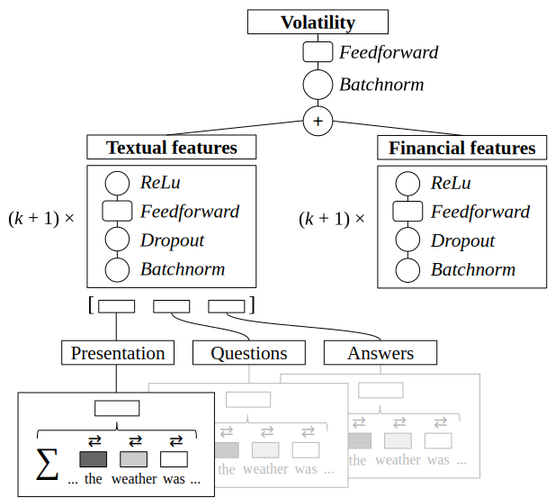

# PRoFET


### Description

This repository contains the code for the neural model from our IJCAI 2019 paper **"PRoFET: Predicting the Risk of Firms from Event Transcripts"** by Christoph Kilian Theil, Samuel Broscheit, and Heiner Stuckenschmidt ([Link](https://www.ijcai.org/proceedings/2019/724)).

The code is provided as is and serves as a documentation for the paper. Since the text data is intellectual property of Thomson Reuters, we are not allowed to publish it. We do however provide the transcript identifiers, which make it possible to reproduce our findings with a valid EIKON subscription. In addition, we provide dummy data following the same structure as the original transcripts. 

The code contains the four models described in the paper, which stem from the following figure:

<p align="center">
  
  <br>
  <em>  PRoFET's architecture (Theil et al., 2019, p. 5214).</em>
</p>

### Models

The models are:
 - `FinanceModel`: uses only finance features and feeds them into an FFN.
 - `TextModel_AverageTokenEmbeddings`: an average pooling model simply averaging the token embeddings per section (presentation, questions, and answers).
 - `TextModel_BidrectionalEmbeddings_and_Attention`: uses a bidirectional LSTM with attention to encode the text fields.
 - `TextModel_BidrectionalEmbeddings_and_Attention_LateFusion_with_Finance`: a combination of the finance and the text attention model.
   
### Usage

##### Quick start

```
git clone https://github.com/samuelbroscheit/neural-profet-private.git
cd neural-profet-private/data
wget http://data.dws.informatik.uni-mannheim.de/theil/profet_embeddings.zip
unzip profet_embeddings.zip
mv profet_embeddings embeddings
cd ..
PYTHONPATH=. python deepreg/scripts/process_data.py
PYTHONPATH=. python deepreg/train.py -c config/TextModel_BidrectionalEmbeddings_and_Attention_LateFusion_with_Finance.yaml
```

##### Preparation

###### Finance data

CSV files for `train`, `validate`, and `test` data are located in the folder `data/source_data/financials/`. The dummy financials are randomly sampled from [our original financial data](http://data.dws.informatik.uni-mannheim.de/theil/profet_financials.zip). If you have a valid Thomson Reuters EIKON subscription, you can use the ID column of our financial data CSV (*not the dummy data*) to retrieve the original transcripts and to reproduce our results.

  - The CSV files contain the training, validation, and test set (with a temporal 80:10:10 split) and have the following columns:
    - `ID`: file name
    - `VOLA_AFTER`: post-filing volatility (the label)
    - `VOLA_PRIOR`: historic volatility
    - `VIX`: market volatility
    - `SIZE`: market capitalization
    - `BTM`: book-to-market ratio
    - `SUE`: standardized unexpected earnings
    - `INDUSTRY`: Fama-French 12-industry dummy

###### Transcript data

Place the transcript data in the folder `data/source_data/transcripts/`. As we are not allowed to publish the original transcript data, this repository contains dummy transcripts created by a 355M ("medium") GPT-2 model fine-tuned on transcript data. 

The structure of transcript data has to adhere to the following:
  - The transcript files contain indices mapping the tokens to their vector representations in the embedding model (via `model.wv.vocab`). The data structure is a nested list:
    1. The first level divides the transcript into the Presentation and the Questions-and-Answers part.
    2. The second level contains individual utterances (i.e. a continuous stream of sentences uttered by one speaker). 
    3. The third level contains the sentences. 
    4. The last level stores the individual token indices.

###### Embeddings

Embedding models are located in `data/embeddings/`. You can either train your own embeddings or use the ones [provided by us](https://www.uni-mannheim.de/dws/people/researchers/phd-students/kilian-theil/).

###### Preprocess Data

To merge the financial data with the transcript data run

```
PYTHONPATH=. python deepreg/scripts/process_data.py
```

which will create a folder `data/transformed_data/` with the merged data in a fast readable format.

##### Training

To train a model, call:

    $ PYTHONPATH=. python deepreg/train.py -c config/$YAML_FILE

with the parameter `-c` pointing to a `YAML_FILE` in the folder `config/` (see "Models" above for descriptions):
 - `FinanceModel.yaml`
 - `TextModel_AverageTokenEmbeddings.yaml`
 - `TextModel_BidrectionalEmbeddings_and_Attention.yaml`
 - `TextModel_BidrectionalEmbeddings_and_Attention_LateFusion_with_Finance.yaml`

###### Options

See the comments in YAML files.

##### Hyper-Parameter Search
 
 To do a hyper-parameter search, call:

    $ PYTHONPATH=. python deepreg/train_hyper.py -c config/$YAML_FILE

###### Grid-based Bayesian Hyperparameter-Optimization:

The Hyperparameter-Optimization takes as input two dictionaries: (a.) model parameters, f.ex. nr. of layers (b.) training parameters, f.ex. learning rate. From those dictionaries a grid of all possible hyper-parameter combinations is created. Initially a certain number of random configurations (`random_exploration_iter`) are sampled from the grid. They are evaluated by: (a.) training each configuration for a certain number of epochs (`search_epochs`) and (b.) evaluating the model --- which was selected by early stopping --- on the validation data. After all random trials have been evaluated, a Gaussian process (GP) regressor is fitted. Then the entire grid of possible configurations is scored, such that a new unseen configuration with the best (i.e., the largest/smallest) predicted performance can be selected, which is then trained and evaluated. The latter procedure is repeated for `train_iter x model_iter x repeat_sample` times and the best seen configuration is trained for `final_epochs`.

###### Options

```
--train_iter                nr. of repetitions of training hyper-parameters
--model_iter                nr. of repetitions of model hyper-parameters
--random_exploration_iter   nr. of configurations that are randomly sampled
--search_epochs             nr. of training epochs during search
--final_epochs              nr. of training epochs for the final best model
```

##### Evaluation

 To evaluate a checkpoint in `data/results/EXPERIMENT_NAME/CHECKPOINT_NAME`:
 
     $ PYTHONPATH=. python deepreg/test.py  --checkpoint data/results/EXPERIMENT_NAME/CHECKPOINT_NAME.pth.tar [--log_text_and_att] [--eval_on_test]

###### Options
     
```
--log_text_and_att      log the attentions in file 
--eval_on_test          do evaluation on the test data, else the evaluation is on validation
```


### Citation

Please cite the corresponding publication in case you make use of this code.

```
@inproceedings{theil2019profet,
  title     = {PRoFET: Predicting the Risk of Firms from Event Transcripts},
  author    = {Theil, Christoph Kilian and Broscheit, Samuel and Stuckenschmidt, Heiner},
  booktitle = {Proceedings of the 28th International Joint Conference on
               Artificial Intelligence, {IJCAI-19}},
  publisher = {International Joint Conferences on Artificial Intelligence Organization},             
  pages     = {5211--5217},
  year      = {2019},
  month     = {7},
  doi       = {10.24963/ijcai.2019/724},
  url       = {https://doi.org/10.24963/ijcai.2019/724},
}
```
